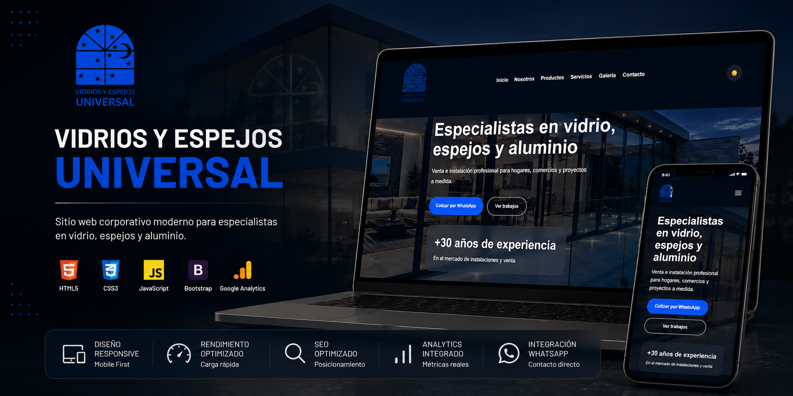

# Vidrios y Espejos Universal

Proyecto personal para un emprendimiento familiar. He tratado de integrar diferentes herramientas nuevas para mi, donde poco a poco iré puliendo y mejorando la web

Sitio web en producción:
https://vidriosuniversal.com

---


---

# Vista previa


---

# Características principales

* Modo oscuro / claro
* Diseño responsive mobile-first
* Galería dinámica con filtros
* Lightbox interactivo
* Optimización WebP
* SEO local optimizado
* Tracking con Google Analytics
* Integración con WhatsApp
* Dominio personalizado
* Integración con Cloudflare
* Animaciones UX/UI modernas

---

# Tecnologías utilizadas

* HTML5
* CSS3
* JavaScript Vanilla
* Google Analytics
* GitHub Pages
* Cloudflare DNS

---

# Estructura del proyecto

```bash
assets/
 ├── css/
 ├── js/
 ├── img/

index.html
robots.txt
sitemap.xml
README.md
```

---

# Funcionalidades implementadas

## SEO y posicionamiento

* Meta tags optimizados
* Open Graph
* Sitemap.xml
* Robots.txt
* SEO local
* Datos estructurados

## Analítica y tracking

* Google Analytics
* Tracking de eventos
* Seguimiento de clics:

  * WhatsApp
  * Instagram
  * Facebook
  * TikTok

## UX/UI

* Navbar dinámica
* Loader inicial
* Menú responsive
* Scroll animations
* Lightbox premium
* Persistencia de dark mode

---

# Aprendizajes obtenidos

Este proyecto permitió implementar y reforzar conocimientos en:

* Desarrollo frontend moderno
* Responsive design
* SEO técnico
* Integración de dominios personalizados
* GitHub Pages
* Cloudflare
* Google Analytics
* Optimización de rendimiento web
* UX/UI orientado a negocio real

---

# Futuras mejoras

* Panel administrativo
* Backend para cotizaciones
* Dashboard de métricas
* Integración con WhatsApp Business API
* Catálogo dinámico

---

# Autor

## Luis Diego Montero Vargas

GitHub:
https://github.com/DiegoMonteroCRC/

LinkedIn:
https://www.linkedin.com/in/diego-montero-vargas/

---

# Licencia

Proyecto desarrollado con fines comerciales y educativos.
